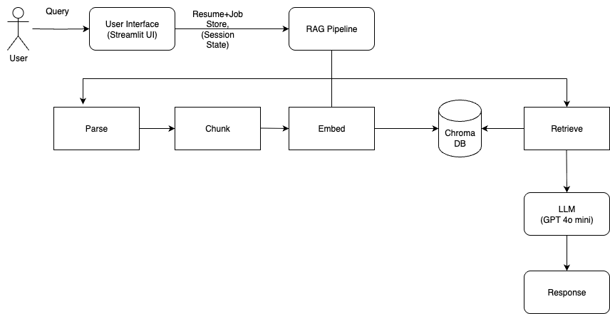

# career-intelligence-assistant
Conversational AI system that analyses resumes against job descriptions to identify skill gaps, experience alignment, and interview readiness using Retrieval-Augmented Generation (RAG).

---
## 1. Quick Setup Instructions

### **Local Setup**
```bash
git clone https://github.com/indrajith-gmb/career-intelligence-assistant.git

cd career-intelligence-assistant

pip install -r requirements.txt
```
Create a `.env` file:
```bash
OPENAI_API_KEY=your-key-here
```
Run the app:
```bash
streamlit run app.py
```

### **Docker Setup**
```bash
docker build -t career-assistant .
docker run -p 8501:8501 -e OPENAI_API_KEY="your-key" career-assistant
```
App will be accessible at: `http://localhost:8501`

---

Sample Questions to Chatbot:
---Upload your resume + multiple job postings → ask questions like  
- "What skills am I missing for Job #1?"  
- "How well does my experience align with Job #2?"  
- "Give me a fit percentage and recommendations"  

The assistant gives grounded answers with **fit percentage**, **skill gaps**, **strengths**, and **actionable recommendations**.
## 2. Architecture Overview

The overall system is intentionally simple but structured enough to mimic production RAG systems.

### **High‑level Components**
- **UI Layer** — Streamlit (fast to iterate, simple event model)
- **RAG Engine** — ChromaDB + Custom Embedding Pipeline
- **LLM Layer** — OpenAI GPT‑4o-mini for generation
- **Parsing Layer** — PDF/DOCX/TXT → clean text → chunks
- **Routing & Orchestration** — Custom Python logic (no LangChain to keep things explicit)
- **Guardrails** — Regex-based validation + PII redaction 
- **Observability** — Logging, latency metrics, request counting - logs are captured in a file career_assistant.log

### **Architecture Diagram 



---

## Tech Stack, Design and Key Technical Decisions 

| Layer               | Technology                         
|--------------------|------------------------------------|
| Frontend / App     | Streamlit                           | 
| Backend / Logic    | Python 3.10+                        | 
| LLM                | GPT-4o-mini (OpenAI)                | 
| Embeddings         | text-embedding-ada-002              | 
| Vector Store       | ChromaDB (in-memory)                | 
| Chunking           | 800 chars + 200 overlap             | 
| Orchestration      | Pure OpenAI SDK                     | 
| Logging            | Python logging → `career_assistant.log` | 
| Session Management | Streamlit `session_state`           | 

---

## Features & Design Choices

- **Conversational memory** — remembers previous questions in the same session
- **Tab isolation** — multiple browser tabs do not interfere with each other
- **RAG pipeline** — resume + all job postings are chunked, embedded, stored per-document in Chroma collections
- **Retrieval** — top-k MMR from resume + relevant job postings → injected into system prompt
- **Fit analysis** — percentage estimate + structured strengths/gaps/recommendations
- **Quick actions** — one-click detailed analysis buttons for each job
- **Guardrails** — basic regex-based input blocking + PII redaction on output

### Key Technical Decisions & Why

- **GPT-4o-mini**  
  → Excellent price/performance for summarization & comparison tasks. Latency low enough for interactive chat.

- **Streamlit**  
  → Wanted a **Python-only** stack with minimal frontend boilerplate. Stateful by design → perfect for chat + file upload flows.

- **No LangChain / LlamaIndex**  
  → Avoided framework tax. Easier debugging, full visibility into prompt construction & retrieval.

- **ChromaDB in-memory**  
  → Zero setup friction for local/dev use. Instant indexing & retrieval. Fewer moving parts → fewer failure modes.  
  Trade-off: data lost on restart (acceptable for personal / demo tool).

- **Chunk size 800 + overlap 200**  
  → Larger chunks preserve more context (important for job descriptions & experience bullets). Overlap reduces boundary artifacts.

- **Logging to `career_assistant.log`**  
  → Simple, file-based tracing. Helps reconstruct issues without external observability stack in early stages.

---

## Productionization & Cloud Deployment (Azure Focus)

Current version is MVP / single-user — great for personal use or demos.

### Deployment Path on Azure

Simplest production option — **Azure App Service** (Linux, Python 3.10+)

- Zip deploy or GitHub Actions → App Service
- Custom startup script:
  - `python -m streamlit run app.py --server.port 8000 --server.address 0.0.0.0`
- Use Premium v3 or Standard tier (B1 minimum; free tier does not support Streamlit reliably)
- Enable always-on + auto-scaling

### Security & Privacy 

- Add **Microsoft Entra ID (Azure AD)** login → protect sensitive resume/job data
- Implement **RBAC** — recruiters vs job-seekers roles
- Use **Azure Private Link** + **VNet integration** to keep traffic internal

### Persistent & Scalable Vector Store

Replace in-memory Chroma → **Azure AI Search** (managed vector + hybrid search, SLA, elastic scaling)  
Alternative: **pgvector** on Azure Database for PostgreSQL (flexible, cost-effective)

### State & History

- Store conversation history + user metadata in **Azure SQL Database** or **Cosmos DB**
- File storage (resumes, parsed text) → **Azure Blob Storage**

### Scalability

- 100–1000+ users → move to **Azure Kubernetes Service (AKS)** or **Azure Container Apps**
- Load balancing + auto-scaling rules based on CPU / requests

### Observability & Monitoring

- **Azure Monitor** + **Application Insights** for metrics, logs, traces
- Track token usage, latency, error rates
- Optional: integrate Langfuse or Phoenix for prompt/retrieval inspection

### CI/CD

- GitHub Actions → build, test, deploy to App Service / Container Apps
- Alternative: Azure DevOps pipelines

---

## Recommended Model Hosting (Production)

**Azure OpenAI Service** (strongly preferred over direct OpenAI API)

- Enterprise-grade: 99.9% SLA, private endpoints, content filters, data residency
- No training on your data (explicit guarantee)
- Provisioned throughput units → predictable latency & cost
- Seamless integration with Azure AI Search

---

## Planned / Possible Enhancements

- Data pipelines — dedicated upload flows for resumes (job seekers) vs job postings (recruiters) → Azure Blob → processing → vector store
- Separate portals — Job-seeker view vs Recruiter view (different RBAC)
- Matching notifications — Pub/Sub (Azure Event Grid / Service Bus) → >90% fit triggers email/SMS/WhatsApp (Twilio / Azure Communication Services)
- Multimodal — Voice-to-text / text-to-voice (Azure AI Speech)
- Agentic workflow — Multiple specialized agents (parsing, matching, question generation, cover letter drafting)
- Unit / integration tests — pytest + mocking OpenAI calls
- API layer — FastAPI middleware / Azure API Management for programmatic access
nt for programmatic access